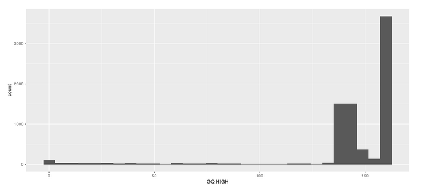

================================================================================
A PBGL Quantitative Locus and Bulk Segregant Analysis in R Sorghum Semi-dwarfism
================================================================================

=====================
:Author: Michael Hall
:Date: 08/09/2022
====================

Software Prerequisites in an Environment .YAML Form
===================================================

.. code:: shell

	name: QTLseqr

	channels:
  	- default
  	- bioconda
  	- conda-forge
  	- r

	dependencies:
  	- r-modeest >= 2.3.2
  	- r-ggplot2 >= 2.2.0
  	- r-gtools
  	- r-dplyr
  	- r-readr
  	- r-tidyr
  	- r-Rcpp
  	- r-locfit
  	- r-knitr
  	- r-rmarkdown
  	- r-kableExtra
  	- r-devtools
  	- r-data.table
  	- r-vcfR
  	- r-optparse
  	- r-base >= 4.1.0
  
Install manually in RStudio
----------------------------

.. code:: shell

	#install the dependencies
	install.packages(c("data.table", 
                   "modeest",
                   "locfit",
                   "dplyr", 
                   "tidyr", 
                   "vcfR", 
                   "ggplot2"), dependencies=TRUE)

	# install devtools
	install.packages("devtools", dependencies=TRUE)

	# use devtools to install QTLseqr from github
	library("devtools")
	#devtools::install_github("bmansfeld/QTLseqr")
	#devtools::install_github("warthmann/QTLseqr")
	devtools::install_github("pbgl/QTLseqr")

	#load dependencies
	library("devtools")
	library("data.table")
	library("dplyr")
	library("tidyr")
	library("vcfR")
	library("ggplot2")

	#load the package
	library("QTLseqr")

Data Analysis
=============

Import VCF
----------

.. code:: shell

	QTLseqr::importFromVCF(file = "freebayes_D2.filtered.vcf",highBulk = "D2_F2_tt",lowBulk = "D2_F2_TT",
	chromList = c("Chr01","Chr02","Chr03","Chr04","Chr05","Chr06","Chr07","Chr08","Chr09","Chr10"),
	,filter=FALSE, outfile=TRUE)
	#Set High bulk and Low bulk sample names and parser generated file name
	#The file name is generated from the QTLParser_1_MH function in line 119

Filter SNPs
-----------

.. code:: shell
  
	#Filter SNPs based on some criteria
	df_filt <-
    QTLseqr::filterSNPs(
    SNPset = df,
    refAlleleFreq = 0.20,
    minTotalDepth = 100,
    maxTotalDepth = 400,
    minSampleDepth = 40,
             minGQ = 99,
    verbose = TRUE
   )

G Prime Analysis
----------------  

.. code:: shell

	#Run G' analysis
	df_filt<-QTLseqr::runGprimeAnalysis(
    SNPset = df_filt,
    windowSize = 5000000,
    outlierFilter = "deltaSNP",
    filterThreshold = 0.1)

QTLseq Analysis
---------------  

.. code:: shell

	#Run QTLseq analysis
	df_filt <- QTLseqr::runQTLseqAnalysis(
    SNPset = df_filt,
    windowSize = 5000000,
    popStruc = "F2",
    bulkSize = c(45, 38),
    replications = 10000,
    intervals = c(95, 99)
	)

Plotting Codes
--------------

.. code:: shell

	#Plot
	QTLseqr::plotQTLStats(SNPset = df_filt, var = "Gprime", plotThreshold = TRUE, q = 0.01)
	QTLseqr::plotQTLStats(SNPset = df_filt, var = "deltaSNP", plotIntervals  = TRUE)

	#export summary CSV
	QTLseqr::getQTLTable(SNPset = df_filt, alpha = 0.01, export = TRUE, fileName = "my_BSA_QTL.csv")
	
	#Plot Depth Distribution
	ggplot2::ggplot(data =df) + geom_histogram(aes(x = DP.LOW + DP.HIGH)) + xlim(0,400)

Plotting Images
---------------

.. image:: ../images/1.png

.. code:: shell
	#Plot Reference Frequency Distribution

	ggplot2::ggplot(data = df) + geom_histogram(aes(x = REF_FRQ))

.. code:: shell
	#Plot Low Bulk Depth Distribution
	ggplot2::ggplot(data = df) + geom_histogram(aes(x = DP.LOW))

.. image:: ../images/3.png

	

.. code:: shell
	#Plot High Bulk Depth Distribution
	ggplot2::ggplot(data = df) + geom_histogram(aes(x = DP.HIGH))

.. code:: shell
	#Plot Genotype Quality Distribution for Low Bulk
	ggplot2::ggplot(data = df) + geom_histogram(aes(x = GQ.LOW))

.. image:: ../images/5.png

.. code:: shell
	#Plot Genotype Quality Distribution for High Bulk
	ggplot2::ggplot(data = df) + geom_histogram(aes(x = GQ.HIGH))

.. code:: shell

	
	#The plot reveals a skewed G Prime statistic with a really small variance. Perhaps it is due to the small number of variants called.
	#In addition, Hampels outlier filter in the second argument, can also be changed to "deltaSNP"
	QTLseqr::plotGprimeDist(SNPset = df_filt, outlierFilter = "Hampel")

.. code:: shell

	#We can see raw data before and after our filtering step
	QTLseqr::plotGprimeDist(SNPset = df_filt, outlierFilter = "deltaSNP",filterThreshold = 0.1)

.. code:: shell

	#Plot Snps as a function of chromosome and position values
	QTLseqr::plotQTLStats(SNPset = df_filt, var = "nSNPs")

.. code:: shell

	#Using QTLStats funciton plot Gprime Statistic with False Discovery Rate Threhshold as a third argument boolean operator as TRUE. The q value is used as FDR threshold null value is 0.05%.
	QTLseqr::plotQTLStats(SNPset = df_filt, var = "Gprime", plotThreshold = TRUE, q = 0.01)
	ggplot2::ggsave(filename = "GPrime.png",plot = last_plot())

.. code:: shell

	#Again using plotQTLStats change second argument varaible to deltaSNP and plot.
	QTLseqr::plotQTLStats(SNPset = df_filt, var = "deltaSNP", plotIntervals  = TRUE)
	ggplot2::ggsave(filename = "DeltaSNPInterval.png",plot = last_plot())

.. code:: shell

	#Add subset argument to focus on particular chromosomes one, three, four, and six.
	#The reason is due to signficant QTL regions
	QTLseqr::plotQTLStats(SNPset = df_filt, var = "Gprime",plotThreshold = TRUE,q=0.01,subset = c("Chr01","Chr03","Chr04","Chr06"))

.. image:: ../images/12.png

